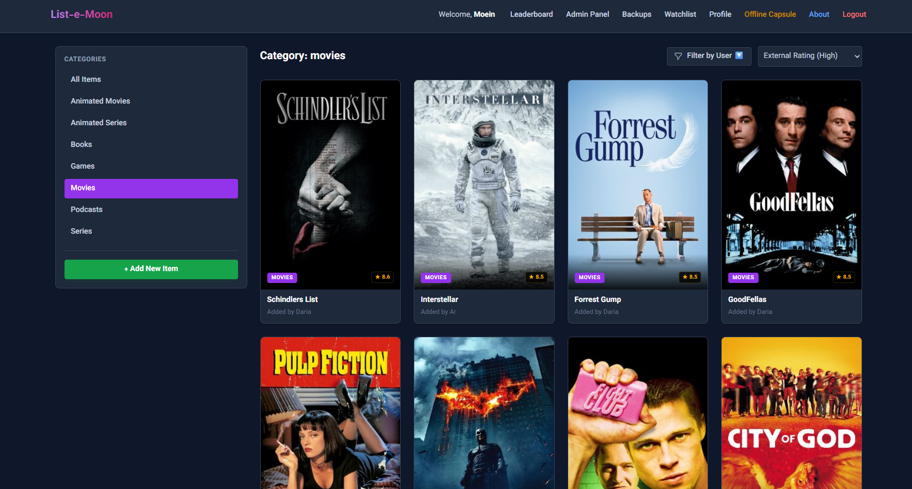
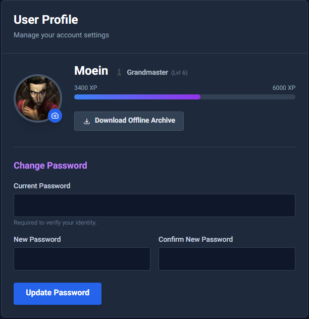

# List-e-Moon
> A Shared Universe for Pop Culture Obsessions. Track. Share. Compete.

List-e-Moon is a beautifully designed, self-hosted PHP application designed to help you track and rate your favorite **Movies, Games, and Books** with friends. Unlike complex commercial alternatives, it focuses on simplicity, privacy, and community features for small groups.

Built with **PHP 8**, **MySQL**, and **Tailwind CSS**, it features a modern, dark-mode "Glassmorphism" UI that looks great on any device.

## 📸 Screenshots


*(Screenshots coming soon)*


*(Screenshots coming soon)*


*(Screenshots coming soon)*

## ✨ Features

* **🎬 Multi-Media Tracking**: Track Movies, Series, Games, Podcasts, and Books in one place.
* **🏆 Leaderboard & XP System**: Earn XP for every rating and climb the leveled ranks (from "Explorer" to "Godlike").
* **👥 Social Feed**: See what your friends are watching, playing, and reading in real-time.
* **📌 Personal Watchlist**: Keep track of the media you want to experience next with a dedicated, private watchlist.
* **📦 Offline Capsule**: Download a static, offline version of your library so you can access your lists anywhere, even without an internet connection.
* **🚀 Automated Web Installer**: Get up and running in seconds with a beautiful GUI installer.
* **🔒 Self-Hosted & Private**: Your data, your server. No tracking, no ads.
* **📱 Mobile-First Design**: A fully responsive interface that feels like a native app.

## 🛠️ Prerequisites

* **PHP 8.0** or higher
* **MySQL** or **MariaDB** database
* **PDO Extension** enabled
* **Apache/Nginx** web server

## 🚀 Installation Guide

1.  **Clone or Download**
    Clone this repository or download the latest release to your server.
    ```bash
    git clone [https://github.com/moein8668-git/List-e-Moon.git](https://github.com/moein8668-git/List-e-Moon.git)
    ```

2.  **Set Permissions**
    Ensure the `config/` directory is writable so the installer can generate the configuration file.
    ```bash
    chmod 755 config/
    # Or 777 if 755 doesn't work on your host
    chmod 777 config/
    ```

3.  **Create Database**
    Create an empty MySQL database (e.g., `list_e_moon`) via your hosting panel (cPanel/phpMyAdmin).

4.  **Run Installer**
    Navigate to `your-domain.com/install.php` in your browser.

5.  **Configure**
    Fill out the beautiful UI form with your Database credentials and Admin account details.

6.  **Cleanup (CRITICAL)**
    > [!IMPORTANT]
    > **Delete `install.php` immediately after successful installation!**

## 📄 License & Credits

This project is open-source software licensed under the **GNU General Public License v3.0 (GPLv3)**.

Created with ❤️ by **[@moein8668-git](https://github.com/moein8668-git)**.